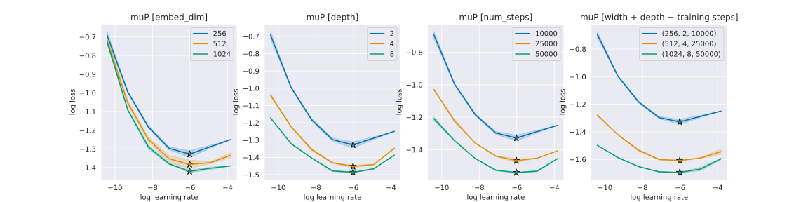
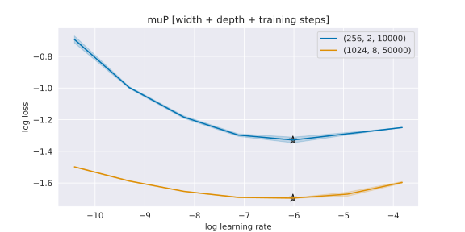

# icl-linear-regression-mup

[](https://pytorch.org/get-started/locally/)
[](https://hydra.cc/)
[](https://black.readthedocs.io/en/stable/)
[](https://github.com/ashleve/lightning-hydra-template#license)



This project is aimed at exploring **zero-shot hyper-parameter transfer** with $\mu\text{P}$ [(Yang et al., 2022)](https://arxiv.org/abs/2203.03466). We will find out whether $\mu\text{P}$ is able to scale an autoregressive transformer for the *in-context linear regression* task presented in [Garg et al., 2022](https://arxiv.org/abs/2208.01066).

> I created this project mostly because I wanted to understand $\mu\text{P}$ better and to have an example implementations for my work. I hope you find it helpful too. If you have questions or feedback please let me know 🧑‍💻

## In-context linear regression
In [Garg et al., 2022](https://arxiv.org/abs/2208.01066), the task is to perform next-token prediction on a sequence $$s_{t,k} = x_0, y_0, \dots, x_k$$
where $$y_i = a_t x_i + b_t$$
with $a_t, b_t$ the linear regression coefficients for the sequence $s_{t,k}$. Since $a_t, b_t$ are different for every $t$, the task of the transformer is to *perform linear regression in-context*, where $s_{t,k}$ is a $k$-shot context; see [Garg et al., 2022](https://arxiv.org/abs/2208.01066) for more details.

## Install
I recommend to set up a conda environment first, e.g., 
```bash
conda create -n icl-linear-regression-mup python=3.10
conda activate icl-linear-regression-mup
```
and then run
```bash
pip install -e .
```
to install `icl-linear-regression-mup` with all dependencies.

## Experiments
This code uses `hydra` to configure experiments; see [https://hydra.cc](https://hydra.cc) for more details and see below for a documentation of all the command line arguments.

To reproduce the results, first tune the learning rate of a small model with `width=256` by running 
```bash
python icl_linear_regression_mup.py -m use_mup=True learning_rate=1e-05,3e-05,9e-05,0.00027,0.00081,0.00243,0.00729,0.02187,0.06561
```
> By default, some parameters and metrics will be written to a file named `results.csv`. You can change the file by setting `results_file` in the command line (see more below). I found it useful to simply write the results into a `csv` file. The format will also be compatible with the `notebooks/scaling.ipynb` notebook, later.

Then, run the same experiments *at scale*, e.g., with more training steps, more layers and a larger width:
```bash
python icl_linear_regression_mup.py -m use_mup=True embed_dim=1024 num_layers=8 num_steps=50000 learning_rate=1e-05,3e-05,9e-05,0.00027,0.00081,0.00243,0.00729,0.02187,0.06561
```
You can now move to the `notebooks/scaling.ipynb` notebook to analyze your results. You should then see that $\mu\text{P}$ is able to transfer the learning rate successfully across both training steps, depth and model width. E.g., using the results provided in `results/demo.csv`:



## Config documentation

|Parameter|Description|
|-|-|
|`learning_rate`|Maximum learning rate during training (might be different when using $\mu\text{P}$, i.e., when `use_mup=True`; see below).|
|`use_mup`|Whether to use $\mu\text{P}$.|
|`num_steps`|Total number of gradient steps during training.|
|`batch_size`|Batch size per gradient step.|
|`weight_decay`|Weight decay parameter passed to `AdamW`.|
|`dropout`|Dropout used during training.|
|`gradient_norm`|Norm for gradient clipping.|
|`base_embed_dim`|Base embedding dimension for $\mu\text{P}$. Tune the learning rate with this embedding dim.|
|`base_num_heads`|Number of heads for the base model in $\mu\text{P}$.|
|`delta_embed_dim`|Delta embedding dimension for $\mu\text{P}$. Ensure that this is different to `base_embed_dim`.|
|`delta_num_heads`|Number of heads for the delta model in $\mu\text{P}$. Change from `base_num_heads` if you wish to scale the number of heads.|
|`num_layers`|Number of transformer layers.|
|`embed_dim`|Embedding dimension of the transformer.|
|`num_heads`|Number of attention heads of the transformer.|
|`seed`|Random seed to use for the run.|
|`log_every`|Log the current training metrics to the console every `log_every` gradient steps.|
|`block_size`|Number of shots for the in-context linear regression problem.|
|`param_range`|Value range for the `a` and `b` linear regression coefficients.|
|`sample_range`|Value range for the inputs `x`.|
|`results_file`|Path to the csv file to which the run results are logged.|